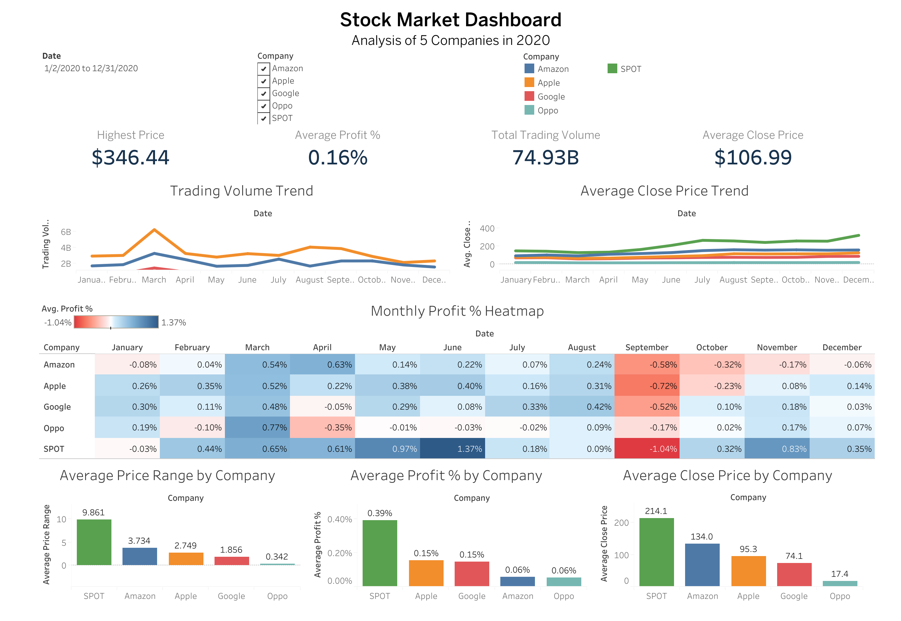

# Stock Market Dashboard

An interactive Tableau dashboard developed during the Data Analysis and Visualization training program at Tuwaiq Academy.

## Overview
The dashboard analyzes stock market data for five companies and presents key performance indicators, trends, and company comparisons.

## Dashboard Features
- Highest stock price
- Average profit percentage
- Total trading volume
- Average closing price
- Monthly trading volume trends
- Monthly profit heatmap
- Company performance comparisons

## Tools
- Tableau
- Data Visualization
- Dashboard Design
- Data Analysis

## Dashboard Preview

## Project File
The packaged Tableau workbook (`.twbx`) is included in this repository.
